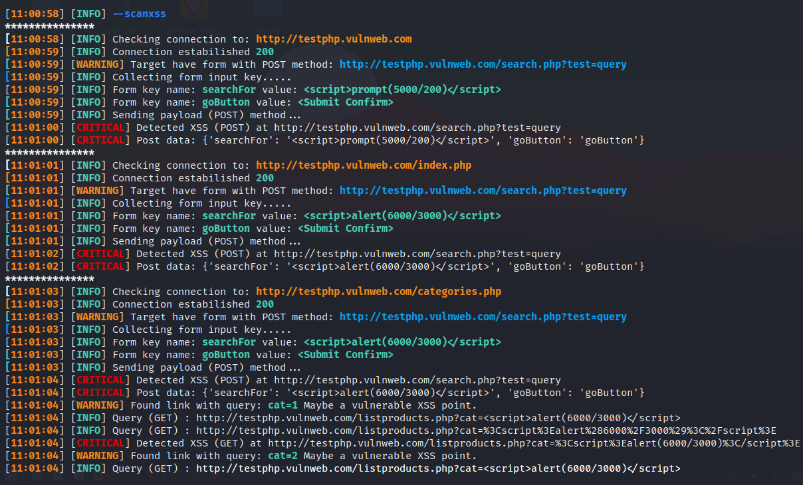
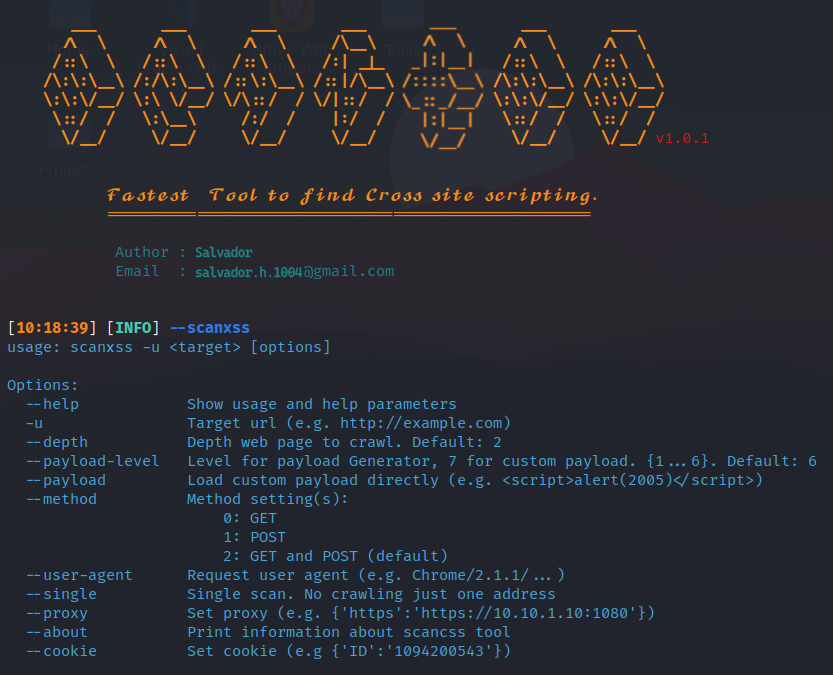
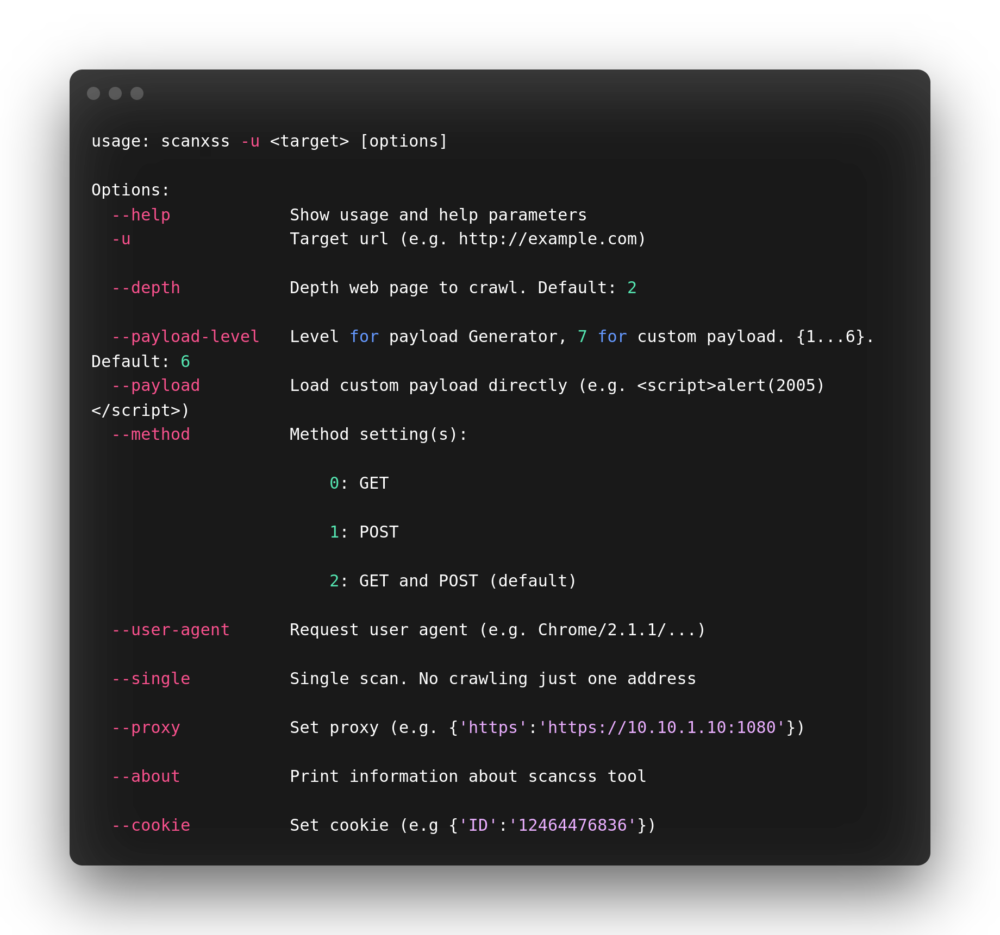

<h1 align="center">
  <br>
  <a  href="https://github.com/Salvelop07/scanxss"></a>
  <br>
  scanxss
  <br>
</h1>

<h4 align="center">Fast and efficient tool that automatically detects XSS.</h4>

<p align="center">
  <a href="https://github.com/Salvelop07/scanxss/releases">
    
  </a>
  <a href="https://travis-ci.com/Salvelop07/scanxss">
    
  </a>
  <a href="https://github.com/Salvelop07/scanxss/issues?q=is%3Aissue+is%3Aclosed">
      
  </a>
</p>



<hr>

### scanxss is a fastest tool to detect Cross Site scripting (XSS) automatically and it's also an intelligent payload generator.

<br>

### Main Features

- Reflected XSS scanning
- Blind xss find
- Crawling all links on a website
- POST and GET forms are supported
- Advanced error handling
- Multiprocessing support

<br>



<br>

### Documentation

### install

```yaml
git clone https://github.com/Salvelop07/scanxss.git
cd scanxss
python -m pip install -r requirements.txt
python3 scanxss.py --help
```

#### Usage

```yaml
========================================================================
usage: scanxss -u <target> [options]

Options:
  --help            Show usage and help parameters
  -u                Target url (e.g. http://example.com)
  --depth           Depth web page to crawl. Default: 2
  --payload-level   Level for payload Generator, 7 for custom payload. {1...6}. Default: 6
  --payload         Load custom payload directly (e.g. <script>alert(2005)</script>)
  --method          Method setting(s):
                        0: GET
                        1: POST
                        2: GET and POST (default)
  --user-agent      Request user agent (e.g. Chrome/2.1.1/...)
  --single          Single scan. No crawling just one address
  --proxy           Set proxy (e.g. {'https':'https://10.10.1.10:1080'})
  --about           Print information about scanxss tool
  --cookie          Set cookie (e.g {'ID':'12464476836'})

========================================================================
```

<br>



### Show ❤️ by starring this repo!

##### Thank You.
